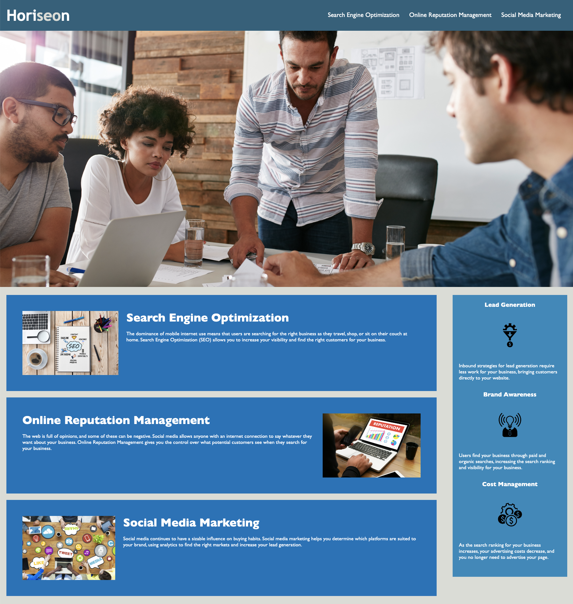

# dont-mess-it-up

The assignment is to refactor code 
for a companies web page without changing the functionality. 

# Hi, I'm Svante' (Suh-Von-Tay)! 👋

## 🚀 About Me
I'm a full stack developer in training. 

## 🛠 Skills
 Practicing Javascript, HTML and CSS

## 🔗 Links

## Screenshots

## Demo

Insert gif or link to demo
https://tesingleton.github.io/dont-mess-it-up/
